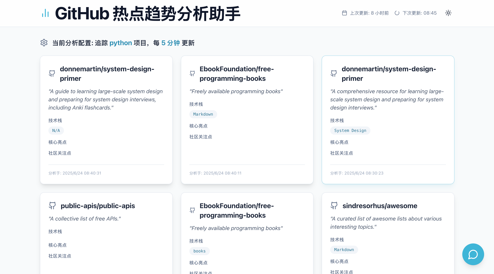
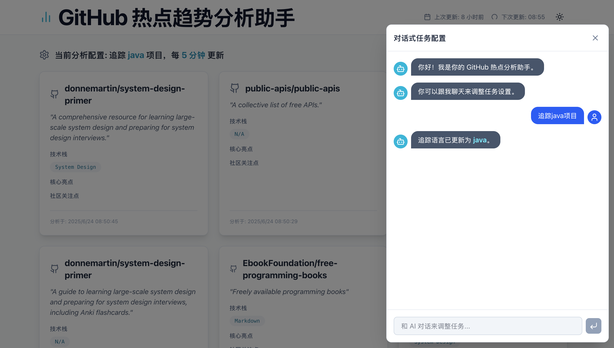
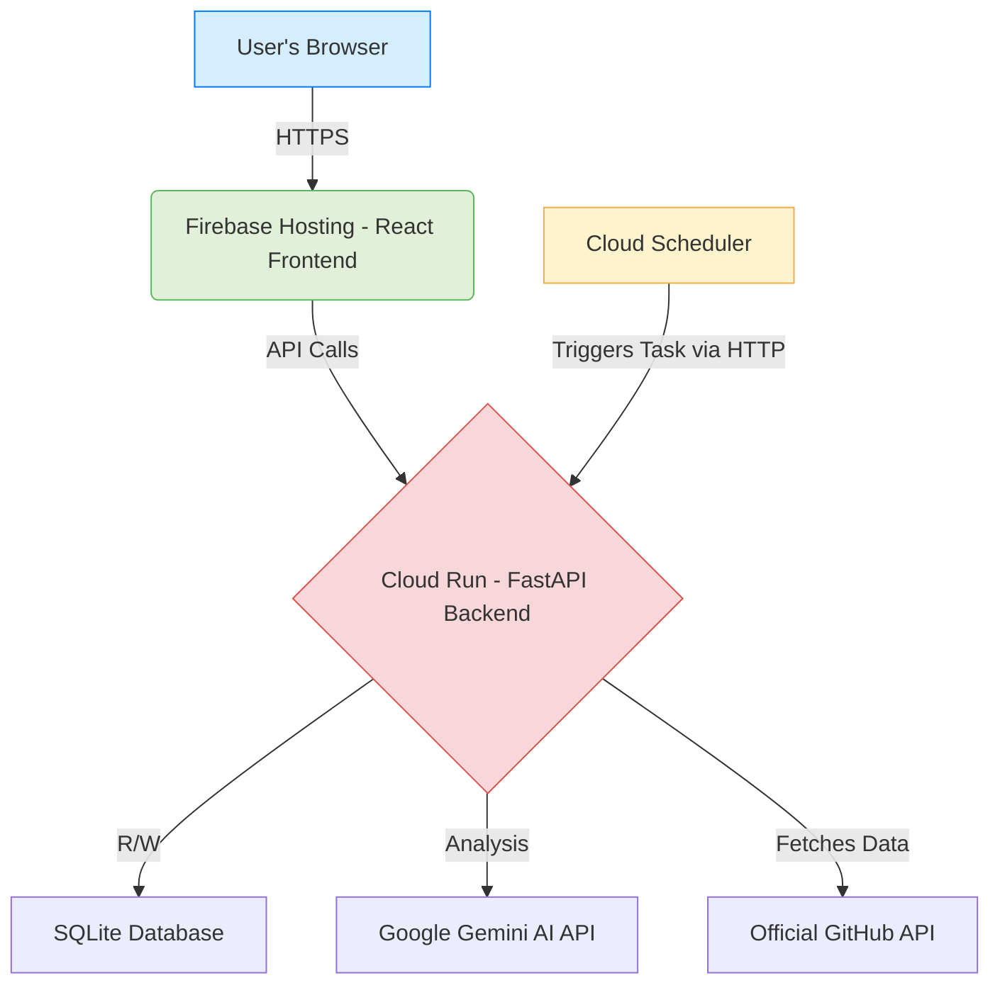

# GitHub Trending AI Analyst

<p align="center">
  
</p>

<p align="center">
    <a href="#"></a>
    <a href="#"></a>
    <a href="#"></a>
    <a href="#"></a>
    <a href="#"></a>
    <a href="#"></a>
</p>

---

[**English**](./README.md) | [**中文**](./README.zh-CN.md)

## 🇬🇧 English

### 🌟 Overview

**GitHub Trending AI Analyst** is a full-stack web application designed to automatically fetch, analyze, and summarize trending projects on GitHub. Instead of manually browsing through endless repositories, this tool leverages AI (Google's Gemini model) to provide you with structured, insightful, and easy-to-digest analysis, helping you stay on top of the latest tech trends effortlessly.

The application features a modern, responsive frontend and a robust, cloud-native backend with scheduled tasks, delivering a seamless and intelligent user experience.

### ✨ Key Features

* **🤖 AI-Powered Analysis**: Automatically scrapes trending repositories and uses the Gemini AI model to generate structured insights, including a one-liner summary, tech stack, key features, and community focus.
* **💬 Conversational Configuration**: Interact with an AI assistant in a chat interface to dynamically change the tracked programming language.
* **🕒 Automated Scheduled Tasks**: A background job, managed by Google Cloud Scheduler, runs periodically to fetch the latest data, ensuring the content is always fresh.
* **🌓 Light & Dark Mode**: A sleek user interface with theme-switching capabilities that respects your system's preferences.
* **☁️ Cloud-Native Architecture**: Built from the ground up to be deployed on Google Cloud Platform, leveraging serverless (Cloud Run) and managed services for scalability, reliability, and cost-effectiveness.

### 🚀 Live Demo

[**(Link to Deployed Application)**](https://ai-trends-463709.web.app/)






### 🏗️ Architecture

The project adopts a modern, decoupled, cloud-native architecture:

* **Frontend**: A responsive React (TypeScript) single-page application hosted on **Firebase Hosting** for global CDN delivery.
* **Backend**: A lightweight FastAPI application running in a Docker container on **Cloud Run**, providing a serverless API.
* **Database**: A simple SQLite database stored in the Cloud Run container's temporary file system.
* **Scheduled Tasks**: A **Cloud Scheduler** job reliably triggers the analysis task via a secure internal API endpoint, completely decoupled from the main web service.
* **AI Services**: All natural language understanding and content analysis tasks are powered by **Google's Gemini API**.
* **Data Source**: Uses the official **GitHub API** for fetching reliable trending repository data.



### 🛠️ Technology Stack

| Area       | Technologies                                             |
| ---------- | -------------------------------------------------------- |
| **Frontend** | React, TypeScript, Vite, Tailwind CSS, Zustand, Lucide Icons |
| **Backend** | Python, FastAPI, SQLModel, Uvicorn, Gunicorn             |
| **AI** | Google Gemini API                                        |
| **Database** | SQLite                                                   |
| **Deployment**| Docker, Google Cloud Run, Firebase Hosting, Cloud Scheduler, GitHub API |

### 🏁 Getting Started (Local Development)

Follow these steps to set up and run the project on your local machine.

#### **Prerequisites**

* Node.js (v18 or later) & PNPM (or NPM/Yarn)
* Python (v3.11 or later)
* Docker Desktop (optional, for building images locally)

#### **1. Clone the Repository**

```bash
git clone [https://github.com/your-username/your-repo-name.git](https://github.com/your-username/your-repo-name.git)
cd your-repo-name
```

#### **2. Backend Setup**

1.  **Navigate to the backend directory:**
    ```bash
    cd backend
    ```
2.  **Create and activate a virtual environment:**
    ```bash
    python3 -m venv venv
    source venv/bin/activate  # On Windows: venv\Scripts\activate
    ```
3.  **Install dependencies:**
    ```bash
    pip install -r requirements.txt
    ```
4.  **Set up environment variables:**
    * Create a `.env` file in the `backend/` directory.
    * Add your API keys to it:
        ```env
        AI_API_KEY="YOUR_GOOGLE_GEMINI_API_KEY"
        GITHUB_TOKEN="ghp_YOUR_GITHUB_TOKEN"
        ```
5.  **Run the backend server:**
    ```bash
    uvicorn app.main:app --reload
    ```
    The backend API will be available at `http://127.0.0.1:8000`.

#### **3. Frontend Setup**

1.  **Navigate to the frontend directory:**
    ```bash
    cd ../frontend # From the backend directory
    ```
2.  **Install dependencies:**
    ```bash
    pnpm install # or npm install
    ```
3.  **Run the frontend development server:**
    ```bash
    pnpm dev # or npm run dev
    ```
    The frontend will be available at `http://127.0.0.1:5173`.

### 🚀 Deployment

This project is designed for a cloud-native deployment on Google Cloud Platform. Please refer to the detailed [**Deployment Guide**](./DEPLOYMENT.md) for step-by-step instructions. *(It's good practice to move long deployment guides to a separate file).*

---