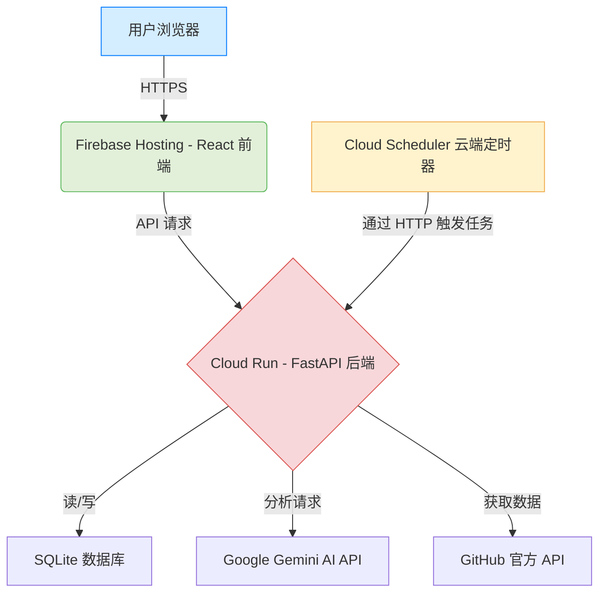

# GitHub Trending AI Analyst

<p align="center">
  
</p>

<p align="center">
    <a href="#"></a>
    <a href="#"></a>
    <a href="#"></a>
    <a href="#"></a>
    <a href="#"></a>
    <a href="#"></a>
</p>

---

[**English**](./README.md) | [**中文**](./README.zh-CN.md)

## 🇨🇳 中文

### 🌟 项目概览

**GitHub 热点 AI 分析助手** 是一个全栈 Web 应用，旨在自动获取、分析并总结 GitHub 上的热门项目。与手动浏览无数代码仓库不同，本工具利用 AI（谷歌的 Gemini 模型）为您提供结构化、富有洞察力且易于理解的分析报告，帮助您轻松掌握最新的技术趋势。

本应用拥有一个现代化的、响应式的前端界面，以及一个健壮的、带有定时任务的云原生后端，为您提供无缝且智能的用户体验。

### ✨ 主要功能

* **🤖 AI 驱动分析**: 自动获取热门仓库，并使用 Gemini AI 模型生成结构化的洞察，包括一句话总结、技术栈、核心亮点和社区关注点。
* **💬 对话式配置**: 通过聊天界面与 AI 助手互动，动态更改您想要追踪的编程语言。
* **🕒 自动化定时任务**: 由 Google Cloud Scheduler 管理的后台任务会周期性运行，以获取最新数据，确保内容永远新鲜。
* **🌓 浅色 & 深色模式**: 设计精美的用户界面，支持主题切换，并能自动适配您的系统偏好。
* **☁️ 云原生架构**: 从零开始构建，专为部署在 Google Cloud Platform 而设计，充分利用无服务器（Cloud Run）和托管服务的优势，以实现可伸缩性、高可靠性和成本效益。

### 🚀 线上体验

[**(Link to Deployed Application)**](https://ai-trends-463709.web.app/)


### 🏗️ 系统架构

本项目采用了一个现代化的、解耦的云原生架构：

* **前端**: 一个响应式的 React (TypeScript) 单页应用，托管于 **Firebase Hosting**，以实现全球 CDN 加速分发。
* **后端**: 一个轻量级的 FastAPI 应用，运行于 **Cloud Run** 的 Docker 容器中，提供无服务器 API。
* **数据库**: 一个简单的 SQLite 数据库，存储在 Cloud Run 容器的临时文件系统中。
* **定时任务**: 一个 **Cloud Scheduler** 作业通过一个安全的内部 API 端点，可靠地触发分析任务，与主 Web 服务完全解耦。
* **AI 服务**: 所有的自然语言理解和内容分析任务均由 **Google Gemini API** 提供支持。
* **数据源**: 使用官方 **GitHub API** 来获取可靠的热门仓库数据。



### 🛠️ 技术栈

| 领域       | 技术栈                                                   |
| ---------- | -------------------------------------------------------- |
| **前端** | React, TypeScript, Vite, Tailwind CSS, Zustand, Lucide Icons |
| **后端** | Python, FastAPI, SQLModel, Uvicorn, Gunicorn             |
| **人工智能** | Google Gemini API                                        |
| **数据库** | SQLite                                                   |
| **部署** | Docker, Google Cloud Run, Firebase Hosting, Cloud Scheduler, GitHub API |

### 🏁 本地启动与开发

请按照以下步骤在您的本地计算机上设置并运行此项目。

#### **环境要求**

* Node.js (v18 或更高版本) & PNPM (或 NPM/Yarn)
* Python (v3.11 或更高版本)
* Docker Desktop (可选, 用于本地构建镜像)

#### **1. 克隆代码仓库**

```bash
git clone [https://github.com/your-username/your-repo-name.git](https://github.com/your-username/your-repo-name.git)
cd your-repo-name
```

#### **2. 后端设置**

1.  **进入后端目录:**
    ```bash
    cd backend
    ```
2.  **创建并激活虚拟环境:**
    ```bash
    python3 -m venv venv
    source venv/bin/activate  # Windows 用户请运行: venv\Scripts\activate
    ```
3.  **安装依赖:**
    ```bash
    pip install -r requirements.txt
    ```
4.  **设置环境变量:**
    * 在 `backend/` 目录下创建一个 `.env` 文件。
    * 在其中添加您的 API 密钥:
        ```env
        AI_API_KEY="YOUR_GOOGLE_GEMINI_API_KEY"
        GITHUB_TOKEN="ghp_YOUR_GITHUB_TOKEN"
        ```
5.  **运行后端服务:**
    ```bash
    uvicorn app.main:app --reload
    ```
    后端 API 将运行在 `http://127.0.0.1:8000`。

#### **3. 前端设置**

1.  **进入前端目录:**
    ```bash
    cd ../frontend # 从后端目录返回上层再进入前端
    ```
2.  **安装依赖:**
    ```bash
    pnpm install # 或 npm install
    ```
3.  **运行前端开发服务:**
    ```bash
    pnpm dev # 或 npm run dev
    ```
    前端应用将运行在 `http://127.0.0.1:5173`。

### 🚀 云端部署

本项目专为在 Google Cloud Platform 上进行云原生部署而设计。详细的、一步步的说明请参考 [**部署指南**](./DEPLOYMENT.md)。*(将冗长的部署指南放到一个单独的文件中是一个很好的实践)*。

